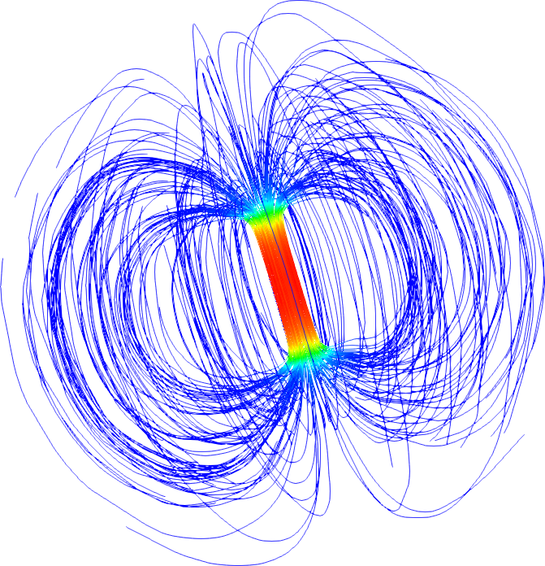

.. FreeFem++ documentation master file, created by
   sphinx-quickstart on Mon Dec 17 09:57:38 2018.
   You can adapt this file completely to your liking, but it should at least
   contain the root `toctree` directive.

Welcome to FreeFem++ documentation
==================================

.. toctree::

  introduction/index
  documentation/index
  reference/index
  tutorial/index
  example/index
  model/index

**FreeFem++** is a partial differential equation solver for non-linear multi-physics systems in 2D and 3D.

Problems involving partial differential equations from several branches of physics, such as fluid-structure interactions, require interpolations of data on several meshes and their manipulation within one program.
**FreeFem++** includes a fast interpolation algorithm and a language for the manipulation of data on multiple meshes.

**FreeFem++** is written in C++ and its language is a C++ idiom.

.. _FreeFem++: https://freefem.org
